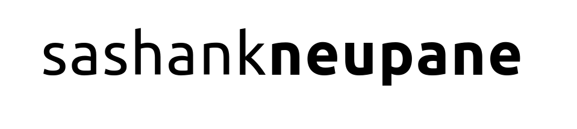

<h1>  Hi, I am Sashank, a <b>learner</b>, <b>coder</b>, and <b>problem solver</b>. </h1>
<h4 center = "align"><a href="https://sashankneupane.com.np">My Personal Website</a></h4>

 I am new to the programming world, but I am fascinated by its power and elegance. With every problem I solve and every line of code I write, I am drawn more into it. I love to tackle hardest problems with beautiful solutions. I aspire to become an AI engineer in the future. 

&nbsp;&nbsp;&nbsp;&nbsp;&nbsp;&nbsp;

---

- I play chess to releive stress and have fun and I am always open for challenges. If you are free and see me online, feel free to hit me up with a challenge. <a href="https://lichess.org/@/sashankneupane">My Lichess acount</a> | <a href="https://www.chess.com/member/knahsas07">My chess.com account</a>.

<h2 ><b>GitHub stats</b></h2>

Don't let the stats fool you. I am just starting.

----

 My favorite programming languages. 

