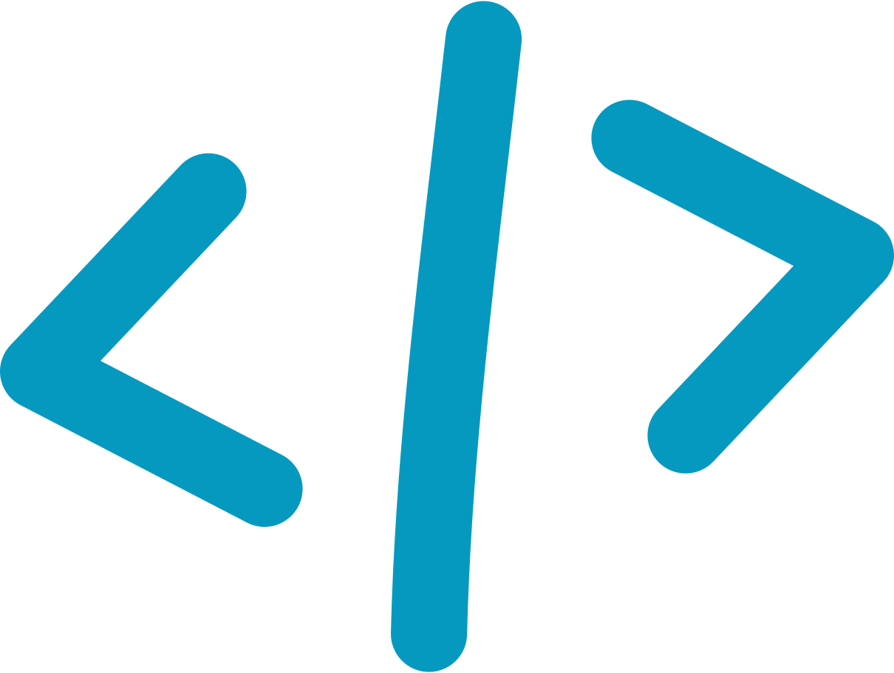

<h2> Hi, I'm Sashank! </h2>

A <b>learner</b>, <b>coder</b>, and <b>problem solver</b>. </h1>

<a href="https://twitter.com/SashankNeupane1" target="blank"></a>&nbsp;&nbsp;<a href="https://www.linkedin.com/in/sashank-neupane-8b4330192/" target="blank"></a>&nbsp;&nbsp;<a href="https://www.instagram.com/neupanesashank/" target="blank"></a>&nbsp;&nbsp;<a href="mailto:sashankneupane7@gmail.com"></a>

<a href="https://github.com/sashankneupane"></a>

[](https://twitter.com/sashankneupane1)

### A little more about me...

```javascript
const knahsas = {
  pronouns: "he" | "him" | "his",
  code: [C++, Python, Javascript, Typescript, React, HTML, CSS, Shell Scripting]
  aspiration: ["AI/ML Engineer"],
};
```

Currently, I am participating in <a href = "https://sites.nyuad.nyu.edu/hackathon/" >NYUAD International Hackathon for Social Good Focusing on Quantum Computing</a>.


Let's connect and share ideas.

...and perhaps play some chess? Challenge me @ <a href="https://lichess.org/@/sashankneupane">My Lichess acount</a> | <a href="https://www.chess.com/member/knahsas07">My chess.com account</a> or play with my <a href="https://lichess.org/?user=blindpirate#friend" target="_blank">lichess bot</a> and have fun!!

---
